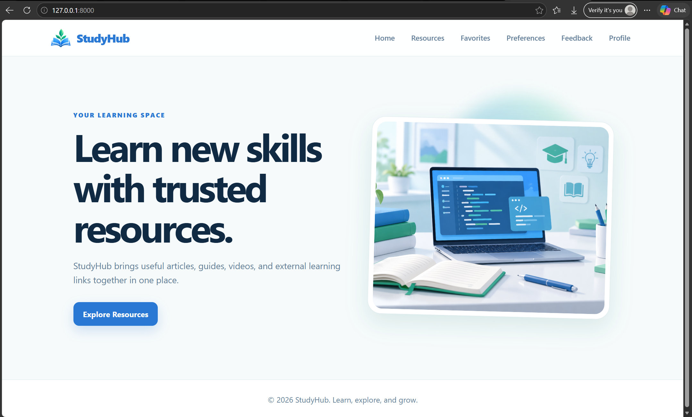
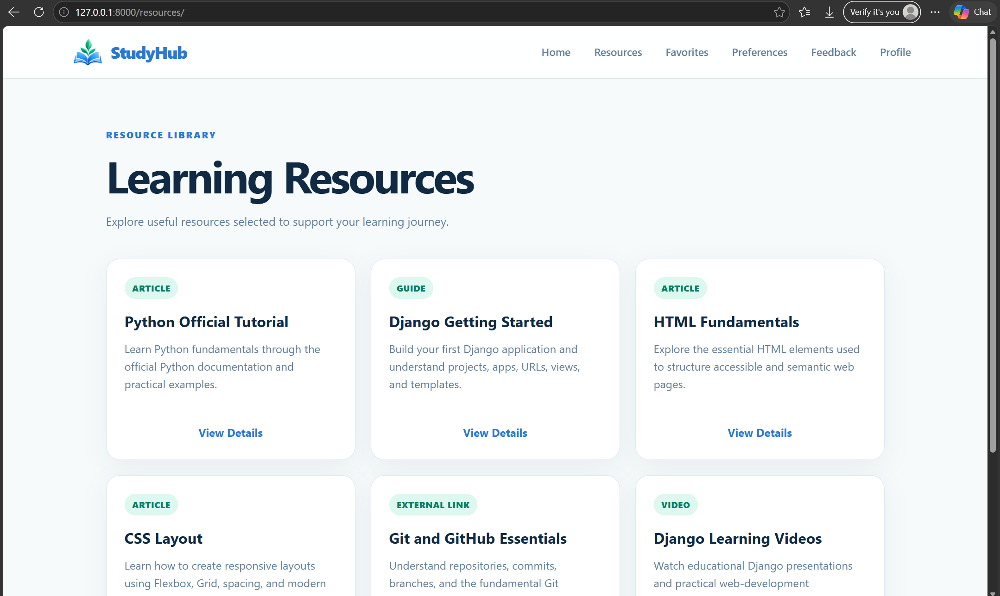
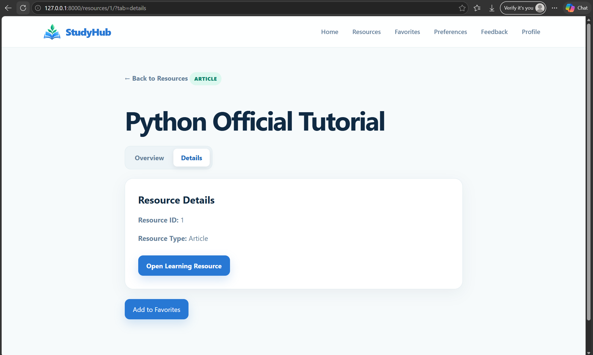
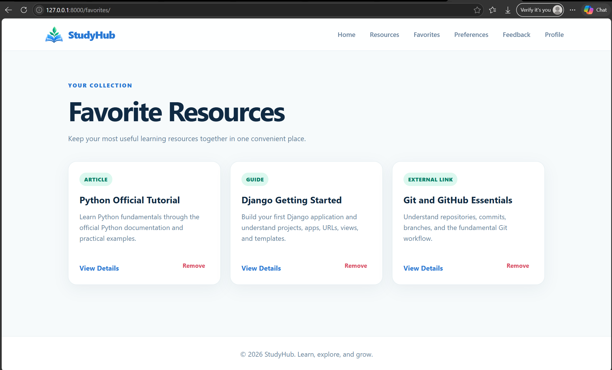
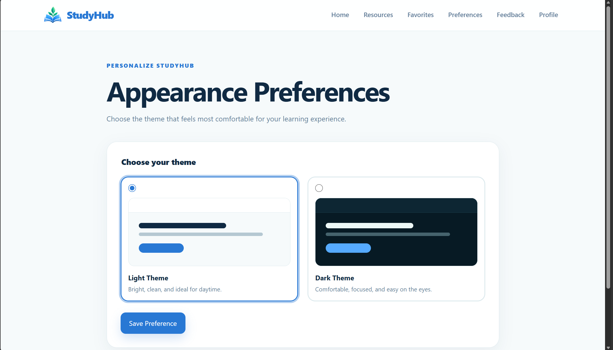
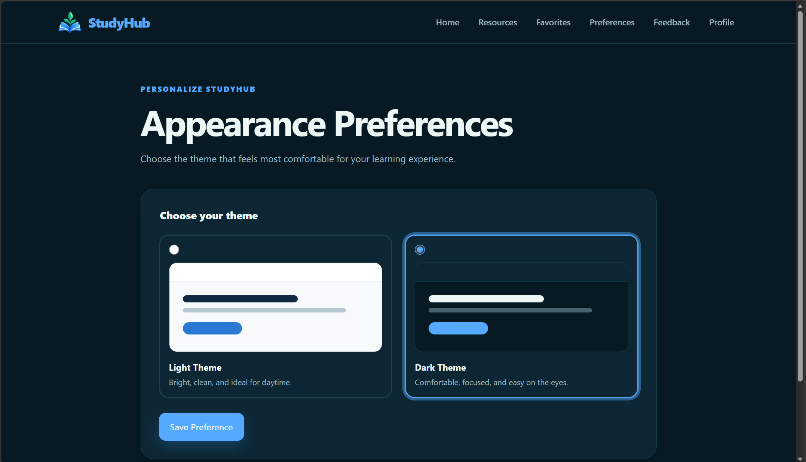
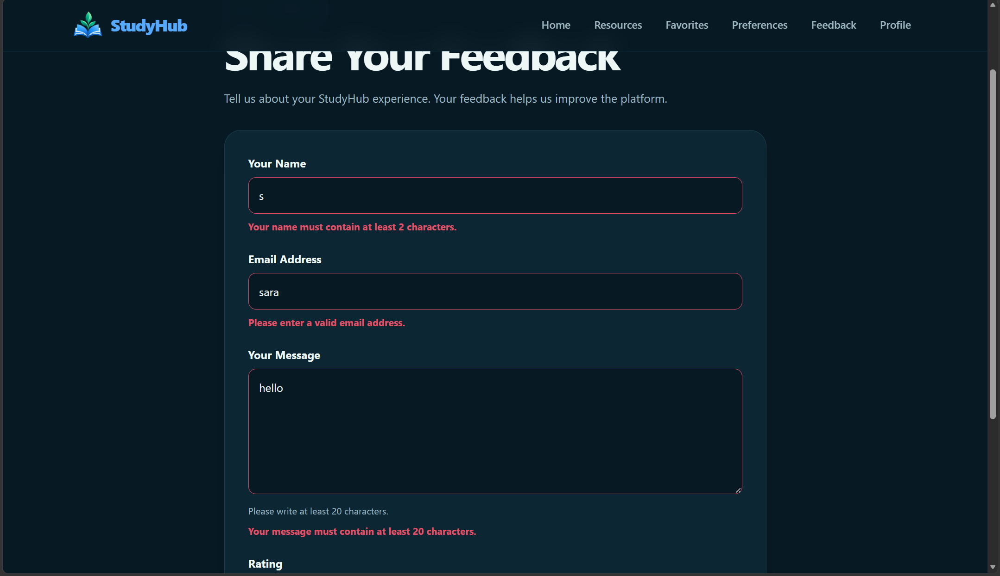
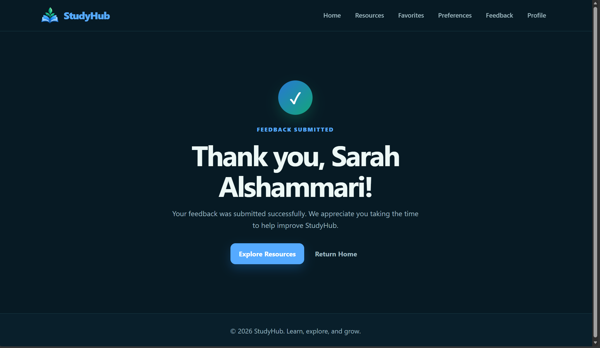

# StudyHub - Learning Resources Portal

StudyHub is a multi-page Django web application that brings trusted learning resources together in one organized portal. The project demonstrates Django fundamentals, including URL routing, views, templates, static and media files, path and query parameters, cookies, sessions, forms, validation, redirects, and custom error handling.

The application was developed as the Unit 4 Django Fundamentals Integration Project.

## Project Features

- Browse a collection of learning resources.
- Open a detail page for each resource using a path parameter.
- Switch between Overview and Details using a query parameter.
- Add and remove favorite resources using Django sessions.
- Select a light or dark theme stored in a browser cookie.
- Submit feedback through a validated Django form.
- Display validation errors next to the relevant form fields.
- Redirect to a separate Thank You page after successful submission.
- Handle invalid resource IDs with a custom 404 page.
- Create a simple learning profile and upload a profile image.
- Display the user's first initial when no profile image is available.
- Use a responsive blue and green interface across the application.

## Technologies Used

- Python
- Django 6.1.1
- HTML5
- CSS3
- SQLite
- Django Templates
- Django Sessions and Cookies
- Pillow for image upload validation

## Project Structure

```text
Sara_Alshammari_StudyHub/
|-- core/
|   |-- data.py
|   |-- forms.py
|   |-- urls.py
|   |-- views.py
|   `-- templates/core/
|       |-- home.html
|       |-- resource_list.html
|       |-- resource_detail.html
|       |-- favorites.html
|       |-- preferences.html
|       |-- feedback.html
|       |-- feedback_thanks.html
|       |-- login.html
|       `-- profile.html
|-- studyhub_project/
|   |-- settings.py
|   |-- urls.py
|   |-- asgi.py
|   `-- wsgi.py
|-- templates/
|   |-- base.html
|   `-- 404.html
|-- static/
|   |-- css/
|   |   |-- base.css
|   |   |-- light.css
|   |   `-- dark.css
|   `-- images/
|       |-- logo.png
|       `-- sample_resource.jpg
|-- media/
|   `-- profile_images/
|-- screenshots/
|-- manage.py
|-- requirements.txt
|-- .gitignore
`-- README.md
```

## URLs and Views

| URL | View | Purpose |
| --- | --- | --- |
| `/` | `home` | Displays the StudyHub home page. |
| `/resources/` | `resource_list` | Displays all learning resources. |
| `/resources/<int:id>/` | `resource_detail` | Displays one resource using a path parameter. |
| `/resources/<int:id>/?tab=details` | `resource_detail` | Changes the visible tab using a query parameter. |
| `/favorites/` | `favorites` | Displays resources stored in the session. |
| `/favorites/add/<int:id>/` | `add_favorite` | Adds a resource to the favorites session. |
| `/favorites/remove/<int:id>/` | `remove_favorite` | Removes a resource from favorites. |
| `/preferences/` | `preferences` | Displays and saves the selected theme. |
| `/feedback/` | `feedback` | Displays and processes the feedback form. |
| `/feedback/thanks/` | `feedback_thanks` | Displays the successful submission page. |
| `/login/` | `simple_login` | Saves a display name in the session. |
| `/profile/` | `profile` | Displays the profile and processes image uploads. |

The project uses app-level routing in `core/urls.py`, project-level routing in `studyhub_project/urls.py`, named URLs, and `include()`.

## Templates

The shared `templates/base.html` template contains the page structure used across the project:

- Header and StudyHub logo
- Reusable navigation
- Dynamic page title block
- Main content block
- Theme-specific stylesheet
- Footer

All page templates extend `base.html`. Django template features used in the project include:

- `` and ``
- `` for internal navigation
- `` for static assets
- `` for protected POST forms
- Loops for displaying resources
- Conditions for themes, tabs, favorites, errors, and profile images
- Variables passed from views through context dictionaries

## Static and Media Files

Static files are stored inside the `static/` directory:

- `base.css` contains the shared layout and component styling.
- `light.css` contains the light-theme color variables.
- `dark.css` contains the dark-theme color variables.
- `static/images/` contains the StudyHub logo and resource image.

Uploaded profile images are stored in `media/profile_images/`. `MEDIA_URL` and `MEDIA_ROOT` are configured in `settings.py`, and media files are served during development through the project URL configuration.

## Theme Preference with Cookies

StudyHub supports light and dark themes. The selected value is validated before it is stored in a cookie named `theme`.

- The default theme is `light`.
- Only `light` and `dark` are accepted.
- The preference remains available while the user navigates between pages.
- The cookie is stored for 30 days.
- The selected theme changes the visual appearance of the application.

## Favorites with Sessions

Favorite resource IDs are stored in `request.session["favorites"]`.

- Resources can be added from the detail page.
- Duplicate favorite IDs are prevented.
- Favorites remain available between requests.
- Resources can be removed from the detail page or favorites page.
- Invalid resource IDs raise an `Http404` response.

## Feedback Form and Validation

The feedback feature uses a Django `forms.Form` class with the following fields:

- Name
- Email
- Message
- Optional rating

The form demonstrates:

- GET and POST request handling
- Bound and unbound forms
- `form.is_valid()`
- `form.cleaned_data`
- Email validation
- Custom minimum message length validation
- Field-specific error messages
- CSRF protection
- Post/Redirect/Get after successful submission

After valid feedback is submitted, the user's name is stored temporarily in the session and the application redirects to a separate Thank You page.

## Profile and Image Upload

The profile feature is an additional enhancement beyond the minimum project requirements.

- A display name is stored in the session.
- The profile image form uses `request.FILES` and `multipart/form-data`.
- Uploaded images are limited to 2 MB.
- Valid images are saved through Django's default storage system.
- If no image exists, the profile displays the first letter of the user's name.

## Error Handling

- Invalid resource IDs are handled with `Http404`.
- A custom `404.html` template provides a clear error message and a link back to the home page.
- Invalid theme values fall back to the light theme.
- Invalid feedback and profile form data display clear field errors.

## Installation and Setup

1. Clone the repository:

```bash
git clone https://github.com/itssara1/Sara_Alshammari_StudyHub.git
cd Sara_Alshammari_StudyHub
```

2. Create and activate a virtual environment:

```powershell
python -m venv venv
.\venv\Scripts\Activate.ps1
```

3. Install the required packages:

```powershell
python -m pip install -r requirements.txt
```

4. Apply the Django migrations:

```powershell
python manage.py migrate
```

5. Run the development server:

```powershell
python manage.py runserver
```

6. Open the application:

```text
http://127.0.0.1:8000/
```

## Screenshots

### Home Page



### Resource List



### Resource Detail



### Favorites Page



### Preferences Page



### Light Theme


### Dark Theme



### Feedback Validation Errors



### Successful Feedback Submission



## Known Limitations

- Resource data is stored in a Python list instead of a database.
- Favorites are associated with the current browser session.
- Theme preferences are stored only in the current browser cookie.
- Feedback is validated but is not permanently stored or sent by email.
- The profile uses a simple session-based name instead of Django authentication.
- Uploaded media files are stored locally during development.
- The project is designed for learning and local development, not production deployment.

## Future Improvements

- Store resources and feedback in database models.
- Add Django authentication and user accounts.
- Add search, filtering, and pagination for a larger resource library.
- Allow users to organize favorites into collections.
- Add automated tests for views, forms, cookies, and sessions.
- Store uploaded media using a production-ready cloud service.
- Deploy the application to a production hosting platform.

## Learning Outcome

This project demonstrates the complete Django request-response flow:

```text
Browser -> URL -> View -> Context -> Template -> Response
```

It also shows how static files, media files, path parameters, query parameters, cookies, sessions, forms, validation, redirects, and error handling fit into a complete Django application.

## Author

**Sara Abdullah Alshammari**

Information Technology Graduate  
Python Web Development Bootcamp
